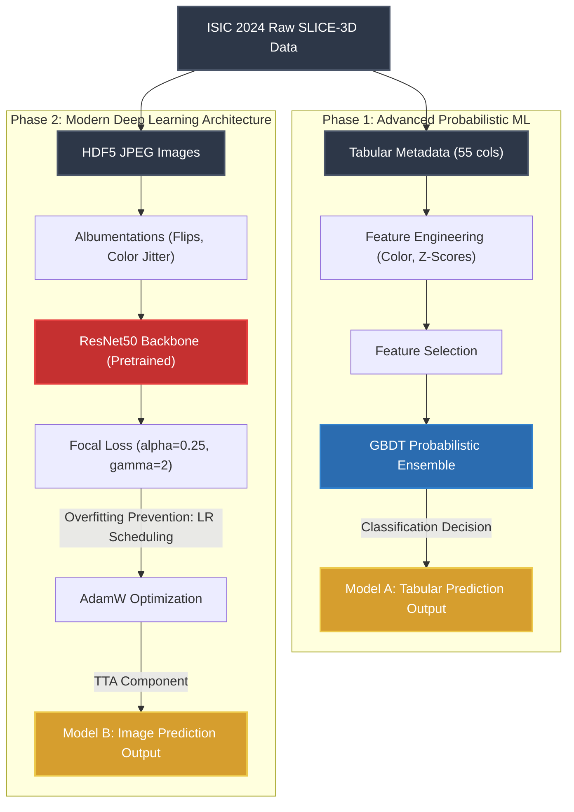

# Data Flow Architecture Diagram (Up to Phase 2)
This diagram fulfills the **Deliverable Requirements (Architecture Diagram)**, outlining the data pipeline limited to the Advanced Probabilistic ML (Phase 1) and the Deep Neural Network Integration (Phase 2).

## Integration Concept
The diagram showcases a dual-channel analytical pipeline where structurally complex image inputs are routed through specialized **Deep Learning rigorously architected blocks (ResNet50)**, while tabular clinical data flows exclusively through **Advanced Probabilistic approaches (Ensembles)**.
